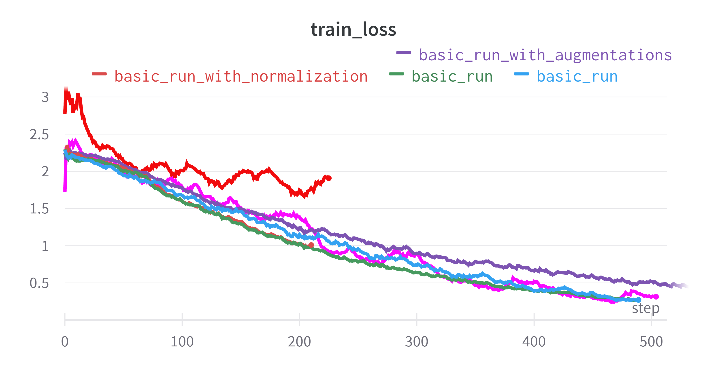
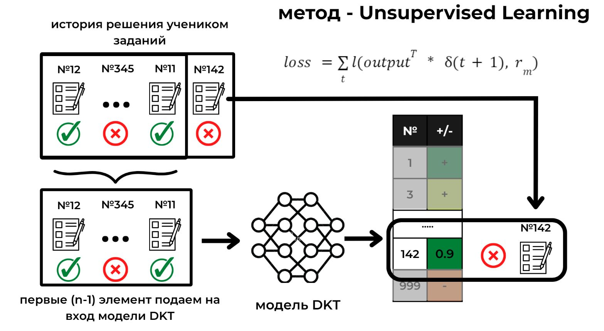
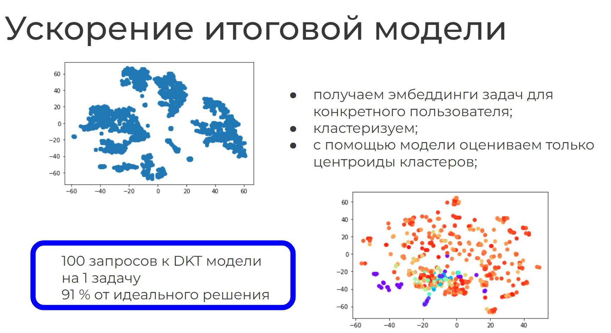

## Репозиторий проекта "Создание рекомендательной системы для образовательных платформ на основе модели глубокого отслеживания знаний"

### Файлы
+ dataset_reading.ipynb - файл с EDA и фильтрацией исходного датасета 
+ dataset_initing.ipynb - файл для сохранения отфильтрованного датасета в формате для обучения модели
+ simple_rnn_model - обучение, тестирование основных Deep knowledge tracing моделей: RNN и SAKT 

Работа посвящена созданию рекомендательной системы заданий и материалов для обучения на примере подготовки к государственным экзаменам. 
Набор алгоритмов и моделей машинного обучения на основе истории решения школьником предыдущих заданий позволяет оценить уровень понимания различных тем и сгенерировать персонализированную учебную траекторию для наиболее эффективной подготовки. 
Модель обучена на датасете, предоставленном платформой РешуЕГЭ с данными о более чем 30 млн решений учеников.
В процессе self-supervised обучения модель обучается предсказывать вероятности решения задач, которые ученик еще не видел.
На основе такой модели можно составлять образовательные траектории с учетом индивидуальных особенностей.
В работе было обучено несколько моделей - RNN и усовершенствованная модель на основе внимания SAKT.
Результаты, которые были достигнуты на полученном от РешуЕГЭ датасете, превосходят многие решения, описанные в цитируемых статьях.

#### Обучение модели
Оптимизатор - Adam(lr=1e-4; momentum=0.9)

#### Кастомная функция ошибки. Self-supervised learning

#### Рекомендация заданий
Когда у нас есть обученная модель DKT, мы можем использовать её вероятности для создания уч траектории.

Общий вид алгоритмы выбора траектории:
- генерация кандидата (ов) заданий для конкретного ученика;
- последовательный проход по новым заданиям модели DKT;
- выбор лучшей траектории исходя из полученных на последнем шаге вероятностей и критерия качества;

Предложенный эвристический алгоритм выбора наилучшей учебной траектории:
- После прямого прохода модели, получим матрицу с предпоследнего линейного слоя - она содержит признаки задач для данного ученика (уровень абстракции на 1 выше, чем вероятность решения)
- Кластеризуем задачи в полученном признаковом пространстве на K кластеров
- Возьмем из каждого кластера центральный сэмпл - посчитаем, какой образовательный прирост он даст
- Выберем кластер с наибольшим образовательным приростом, отбросим остальные
- Заново кластеризуем оставшиеся сэмплы на K/2 кластеров
- Повторим данную процедуру пока размер кластера > 10
- Когда кластер становится меньше 10 сэмплов - полным перебором найдем наилучший

Алгоритм основывается на том, что векторные представления, полученные на предпоследнем 
слое модели описывают задания уже в контексте учебной траектории, а значит по ним можно делать вывод о близости заданий для построеиня траектории.

#### Используемые источники
- https://arxiv.org/pdf/1506.05908.pdf - первая формализация проблемы глубокого отслеживания знаний; базовое решение поставленной задачи;
- https://arxiv.org/pdf/2112.15072.pdf - метрики и базовые архитектуры DKT моделей;
- https://arxiv.org/pdf/1602.07029.pdf - пример практического использования DKT моделей;
- https://arxiv.org/pdf/2106.04262.pdf - описание возможного подхода для генерации персонализированного контента на основе DKT модели;
- https://arxiv.org/pdf/2112.10125.pdf - очень перспективная работа о применении обучения с подкреплением для генерации образовательной траектории; для подсчета reward используется уже обученная DKT модель;
  - https://github.com/hcnoh/knowledge-tracing-collection-pytorch

