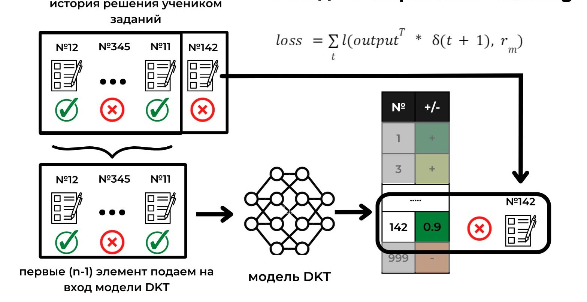

## deep knowledge tracing algorithms and methods ##
## Репозиторий проекта "Создание рекомендательной системы для образовательных платформ на основе модели глубокого отслеживания знаний"
Работа посвящена созданию рекомендательной системы заданий и материалов для обучения на примере подготовки к государственным экзаменам. Набор алгоритмов и моделей машинного обучения на основе истории решения школьником предыдущих заданий позволяет оценить уровень понимания различных тем и сгенерировать персонализированную учебную траекторию для наиболее эффективной подготовки. Модель обучена на датасете, предоставленном платформой РешуЕГЭ с данными о более чем 30 млн решений учеников.

#### Обучение модели
Оптимизатор - Adam(lr=1e-4; momentum=0.9)

#### Кастомная функция ошибки. Unsupervised learning

#### Рекомендация заданий
Перебор оптимальных вариантов выдает асимптотику O(!n) - слишком долго
Генетические алгоритмы не сходятся 
Используем оптимизацию:
- После прямого прохода модели, получим матрицу с предпоследнего линейного слоя - она содержит признаки задач для данного ученика (уровень абстракции на 1 выше, чем вероятность решения)
- Кластеризуем задачи в полученном признаковом пространстве на K кластеров
- Возьмем из каждого кластера центральный сэмпл - посчитаем, какой образовательный прирост он даст
- Выберем кластер с наибольшим образовательным приростом, отбросим остальные
- Заново кластеризуем оставшиеся сэмплы на K/2 кластеров
- Повторим данную процедуру (с пункта c) пока размер кластера > 10
- Когда кластер становится меньше 10 сэмплов - полным перебором найдем наилучший

#### Используемые источники
- https://arxiv.org/pdf/1506.05908.pdf - первая формализация проблемы глубокого отслеживания знаний; базовое решение поставленной задачи;
- https://arxiv.org/pdf/2112.15072.pdf - метрики и базовые архитектуры DKT моделей;
- https://arxiv.org/pdf/1602.07029.pdf - пример практического использования DKT моделей;
- https://arxiv.org/pdf/2106.04262.pdf - описание возможного подхода для генерации персонализированного контента на основе DKT модели;
- https://arxiv.org/pdf/2112.10125.pdf - очень перспективная работа о применении обучения с подкреплением для генерации образовательной траектории; для подсчета reward используется уже обученная DKT модель;
- https://github.com/hcnoh/knowledge-tracing-collection-pytorch

